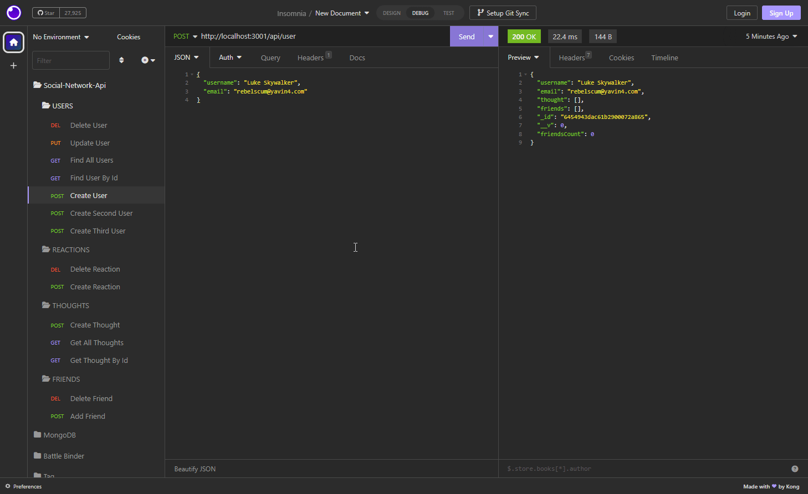
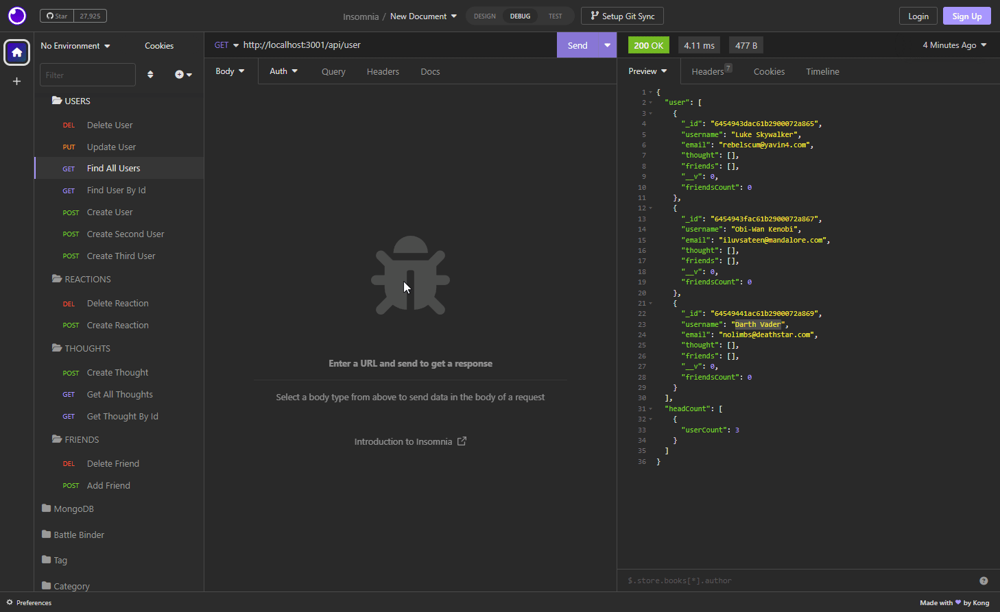

# Social-Network-Api

## Created By
   - 
   - Cory 
   - @MacaroniKetchup
## Table of Contents
  - [Description](#description)
  - [Installations](#installations)
  - [Usage](#usage)
  - [Contact-Info](#contact)
  - [Contributions](#contributions)
  - [Testing](#testing)
  
* [License](#license)

## Description

A Social Network Back-End Api where a database is created and you can store users, thoughts, react to thoughts, and add friends to users

## Installations

* Insomnia
* MongoDB
```
"dependencies": {
    "express": "^4.17.1",
    "moment": "^2.29.4",
    "mongoose": "^7.0.2"
  },
  "devDependencies": {
    "nodemon": "^2.0.9"
  }

```
## Usage

To use this app ```npm install``` the listed dependancies in the instalations list above. In the terminal run the ```npm run dev``` command once you'll then get 
```> social-network-api@1.0.1 dev
> nodemon index

[nodemon] 2.0.22
[nodemon] to restart at any time, enter `rs`
[nodemon] watching path(s): *.*
[nodemon] watching extensions: js,mjs,json  
[nodemon] starting `node index index.js`    
API server for running on port 3001!
```
in your terminal. Open up insomnia to ```localhost:3001``` from there you can then run the requests as show in the demo's below


## Demo

### User Routes


### Thought & Friend Routes


### Reaction Routes

* Reaction routes are still in progress due to debugging

## Contributors
If you would like to make contributions or edit this code on your own you can fork this project from the repo located on my GitHub profile. Or you can contact me via email, both of these will be located in the bottom of the README file or you can quick access my contact infrom via the table of contents.
## Contact-Info
- Name: Cory
- Email: stylesthestyer@gmail.com
- Github: [MacaroniKetchup](https://github.com/MacaroniKetchup/)
## Testing
```
No tests were written for this project
```
## License

      licensed under the MIT license.